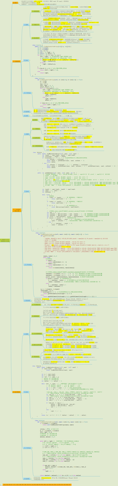

### LeetCode-4 寻找两个有序数组的中位数
#### [题目描述](https://leetcode.cn/problems/median-of-two-sorted-arrays)
给定两个大小分别为 m 和 n 的正序（从小到大）数组 nums1 和 nums2。请你找出并返回这两个正序数组的 中位数 。

算法的时间复杂度应该为 O(log (m+n)) 。
#### 示例
**输入**：nums1 = [1,3], nums2 = [2]    
**输出**：2.00000   
**解释**：合并数组 = [1,2,3] ，中位数 2 
#### 解题方法
##### 方法一
**思路**    
利用归并排序的思想, 将两个数组合并为一个有序的数组, 再去查找合并后的有序数组的中位数    
**时间复杂度**  
**空间复杂度**  
**优化**    
其实并不需要真的得到一个合并后的有序数组, 题目的只要求取得中位数, 两个有序数组的长度是已知的, 那么最终的中位数的位置也是固定的, 只要按照归并排序的思想, 取到中位数就可以, 不用取完所有的数, 只需要取一半. 但是需要注意的是, 当数组的个数是奇数时, 取到中位数时就可以停止; 如果是偶数时, 需要记录取到中位数时的是一次的数字, 然后两个数取平均， 每次循环需要记录两个变量 left 和 right，right 保存当前循环的结果，在每次循环前将 right 的值赋给 left。这样在最后一次循环的时候，left 将得到 right 的值，也就是上一次循环的结果，接下来 right 更新为最后一次的结果      
不管是奇数还是偶数, 都只需要循环n/2次   

```python
    # 代码存在问题，还需要调试, 判断条件有问题
    def findMedianSortedArrays(self, nums1, nums2):
        n = len(nums1)
        m = len(nums2)
        length = n+m
        i = 0
        j = 0
        left = -1
        right = -1
        if n == 0:
            return (nums2[m//2-1] + nums2[m//2])/2 if m%2==0 else nums2[m//2]
        if m == 0:
            return (nums1[n//2-1] + nums1[n//2])/2 if n%2==0 else nums1[n//2]
        for k in range(length//2+1):
            left = right
            if i < n and j < m and nums1[i] <= nums2[j]:
                right = nums1[i]
                i += 1
            else:
                right = nums2[j]
                j += 1
            
        return (left+right)/2 if length%2==0 else right
        

``` 


##### 方法二
**思路**    
直接利用list的属性, 将两个有序数组进行相加, 再利用内置的sort()函数进排序, 最后找出排序后的中位数    
```python
def findMedia(nums1, nums2)
    nums = nums1 + nums2
    nums.sort()
    n = len(nums)
    return (nums[n//2-1]+nums[n//2])/2 if n%2==0 else nums[n//2]
```
**时间复杂度**  
list的加法需要时间`O(m+n)`  
list排序需要时间`O(m+n)log(m+n)`    
**空间复杂度**  
两个有序数组相加, 空间复杂度是`O(m+n)`  
**知识点**
* python中内置的sort()函数使用的是什么排序算法, 源代码在哪里?
* python中list的加法, 实现的源代码在哪里?

#### 方法三
**思路**    
利用求第k小的解题思路   
- 主要思路：要找到第 k (k>1) 小的元素，那么就取 pivot1 = nums1[k/2-1] 和 pivot2 = nums2[k/2-1] 进行比较
- 这里的 "/" 表示整除
- nums1 中小于等于 pivot1 的元素有 nums1[0 .. k/2-2] 共计 k/2-1 个
- nums2 中小于等于 pivot2 的元素有 nums2[0 .. k/2-2] 共计 k/2-1 个
- 取 pivot = min(pivot1, pivot2)，两个数组中小于等于 pivot 的元素共计不会超过 (k/2-1) + (k/2-1) <= k-2 个
- 这样 pivot 本身最大也只能是第 k-1 小的元素
- 如果 pivot = pivot1，那么 nums1[0 .. k/2-1] 都不可能是第 k 小的元素。把这些元素全部 "删除"，剩下的作为新的 nums1 数组
- 如果 pivot = pivot2，那么 nums2[0 .. k/2-1] 都不可能是第 k 小的元素。把这些元素全部 "删除"，剩下的作为新的 nums2 数组
- 由于我们 "删除" 了一些元素（这些元素都比第 k 小的元素要小），因此需要修改 k 的值，减去删除的数的个数
```python
def findMedianSortedArrays(nums1, nums2):
    def getKthElement(k):
        index1, index2 = 0, 0
        while True:
            # 特殊情况
            if index1 == m:
                return nums2[index2 + k - 1]
            if index2 == n:
                return nums1[index1 + k - 1]
            if k == 1:
                return min(nums1[index1], nums2[index2])

            # 正常情况
            newIndex1 = min(index1 + k // 2 - 1, m - 1)
            newIndex2 = min(index2 + k // 2 - 1, n - 1)
            pivot1, pivot2 = nums1[newIndex1], nums2[newIndex2]
            if pivot1 <= pivot2:
                k -= newIndex1 - index1 + 1
                index1 = newIndex1 + 1
            else:
                k -= newIndex2 - index2 + 1
                index2 = newIndex2 + 1
    
    m, n = len(nums1), len(nums2)
    totalLength = m + n
    if totalLength % 2 == 1:
        return getKthElement((totalLength + 1) // 2)
    else:
        return (getKthElement(totalLength // 2) + getKthElement(totalLength // 2 + 1)) / 2

```

#### 题目分析
#### 参考的题目解析
* https://leetcode.cn/problems/median-of-two-sorted-arrays/solution/xiang-xi-tong-su-de-si-lu-fen-xi-duo-jie-fa-by-w-2/
#### 同类型题目
#### 考察知识点
#### 相关的连接
#### 知识树

#### 易错点
#### 做题时困惑的点
#### 可以复习的内容
* 各种排序算法的基本原理以及代码实现
* 
